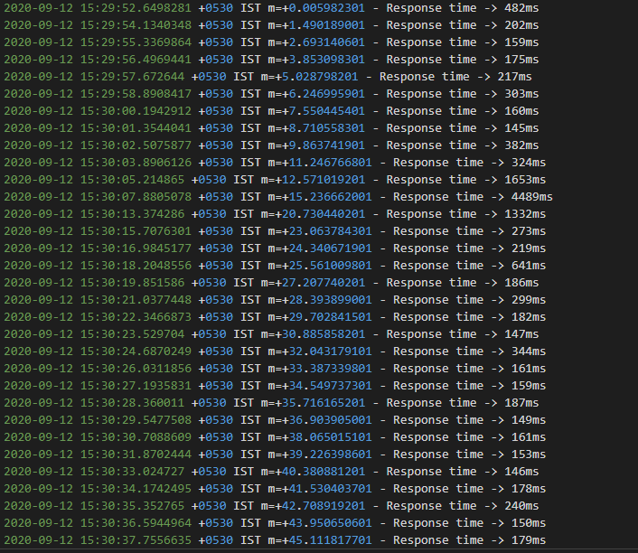
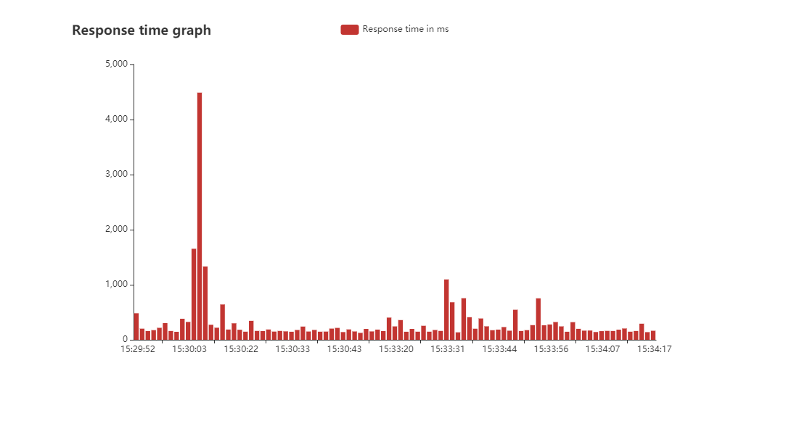

# HealthCheck

This web app performs health checks on websites.
Logs are generated for each time health check is performed.
Visulaizations can be created based on the logs, either daily or for entire history.

---

## Getting Started

### Prerequisites
* Clone this repo to your local machine.
* Install Go if you haven't

### Initial Setup
* Change vizFolder from analysis package to create visualization in that folder
    ```
    var (
        vizFolder string = "../../visualization/"
    )
    ```

### How to use
```go
// To get 1, 90, 95 and 99th percentiles
percentile.PerformHealthCheck()

/* For periodic checks
   flags : url, loc, duration on running it through commandLine */
periodiccheck.Check()

// Logs are generated only for periodic checks

// To analyze all logs
analysis.AnalyzeAllLogs(<Your log location>)

// To analyze today's logs
analysis.AnalyzeTodaysLog(<Your log location>)
```

### Images
  
 
---
# Authors
* RapiDash1